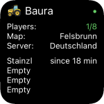
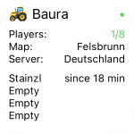

# Farming Simulator 19 Server Status

This widget shows the online status of a Farming Simulator 19 server.
It displays basic information as well as the players that are online.

## Configuration
The configuration is done by a semicolon seperated string.
The value is seperated by a colon from the key.

Requiered opitions are
- `url` The url to fetch the informations of the server
- `chacheId` A name, under which the base informations are stored, to display them, if the server isn't running

Optional you can pass
- `lang` currently are `en` and `de` are supported

A valid configuration could be `url:<insert your url>;cacheId:mainServer`.
